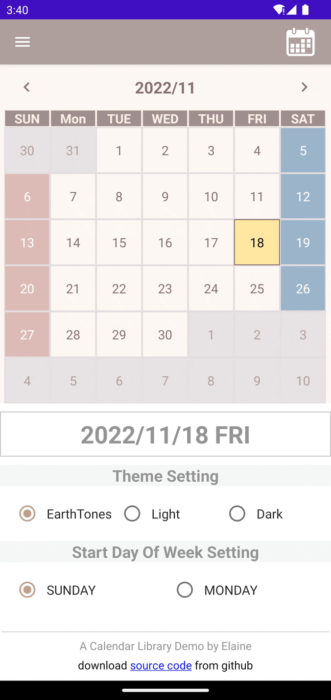
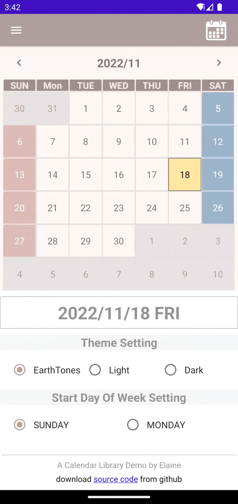
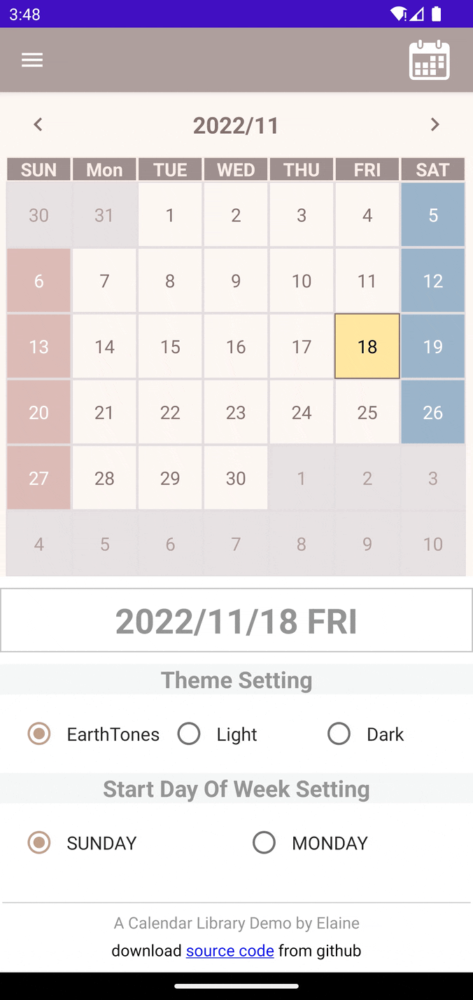

A Custom Calendar Library based on Kotlin MVVM architecture and compose

## Features
1. There are three calendar view : Month/One Week/Two Week
2. Swiping left or right to change calendar page
3. Providing three calendar theme : EarthTones/Light/Dark
4. Setting which day is the start day of week

## Tech/Tools
* [Kotlin](https://kotlinlang.org/) 100% coverage
* [Jetpack](https://developer.android.com/jetpack)
    * [Compose](https://developer.android.com/jetpack/compose) 
    * [ViewModel](https://developer.android.com/topic/libraries/architecture/viewmodel) that stores, exposes and manages UI state
    * [MutableState](https://developer.android.com/jetpack/compose/state)
* [Hilt](https://developer.android.com/training/dependency-injection/hilt-jetpack) for dependency injection

    
